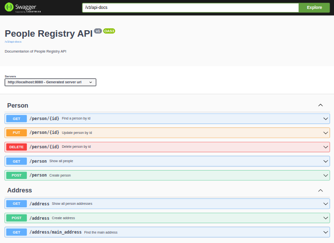

# Boas vindas ao repositório do projeto People Registry!!

[](https://github.com/Humberto-Bonadiman/people-registry/actions/workflows/docker-publish.yml)

---

## Descrição do projeto

Neste projeto eu fui responsável por criar uma API REST responsável por gerenciar informações de pessoas e seus endereços utilizando Java com Spring-boot e o Hibernate.

---

## Instalação do projeto localmente

Após cada um dos passos, haverá um exemplo do comando a ser digitado para fazer o que está sendo pedido.

1. Realize o clone do projeto no diretório de sua preferência:
```javascript
  git clone git@github.com:humberto-bonadiman/people-registry.git
```

2. Acesse o diretório do projeto e depois utilize o comando **mvn install** para instalar todas as dependências necessárias:
```javascript
  cd people-registry
  mvn install
```

3. Após empacote o código compilado com o comando **mvn package**:
```javascript
  mvn package
```

---

## Comandos para utilizar o Docker

Para criar e iniciar os contêineres:
</br>
Obs.: Com o comando abaixo o docker fica rodando no terminal.
```javascript
docker-compose up
```

Para criar e iniciar os contêineres em stand-by:
```javascript
docker-compose up -d
```

Para realizar apenas a etapa de build das imagens que serão utilizadas:
```javascript
docker-compose build
```

Para paralisar e remover todos os contêineres e seus componentes como rede, imagem e volume:
```javascript
docker-compose down
```
---

## Utilizando o Spring-boot sem o Docker

Rodar o Spring-Boot com o comando:
```javascript
mvn spring-boot:run
```

---

## Realização dos testes

Para realizar todos os testes da aplicação você pode utilizar o seguinte comando:
```javascript
mvn clean test
```

Para realizar somente um teste específico você deve utilizar o comando:
```javascript
mvn test -Dtest=O_nome_do_teste_vai_aqui
```

---

## Documentação



Para acessar a documentação pelo swagger rode o comando **mvn spring-boot:run** ou **docker-compose up** e acesse o projeto via browser, no caminho http://localhost:8080/swagger-ui/index.html ou pelo caminho http://localhost:8080/v3/api-docs.
